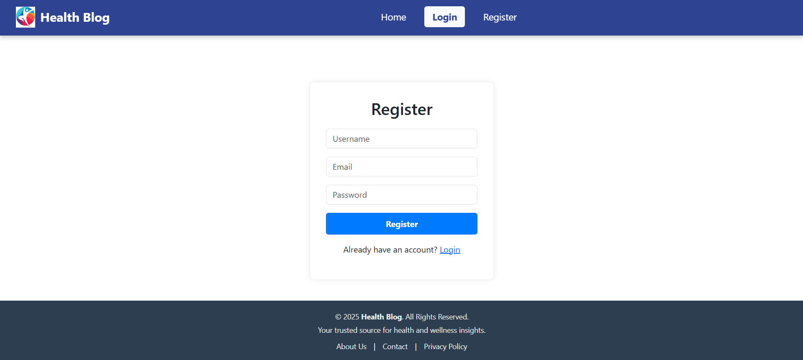

# Blogging_System

Blogging System for Healthcare
A simple PHP & MySQL blogging platform designed for sharing healthcare-related blogs.  
Registered users can create posts, comment, and interact in a secure environment. 

 Features  
- User registration & login (authentication)  
- Create, edit, and delete blog posts  
- Comment system for discussions  
- Homepage with navigation and introduction  
- Database-driven with MySQL integration  
- Secure session management

Tech Stack  
- Frontend: HTML, CSS, JavaScript  
- Backend PHP  
- Database MySQL  
- Server Apache/XAMPP

  ScreenShots-

  1.Home page- 

  2.Add Blog Page- 

  3.Blog Category- 

  4.Login Page- 

  5.Registration Page- 

  6.View Blog- 

  Installation and Setup-
  1. Clone this repositary in xammp/htdocs folder.
  2. First create database health_db.sql in phpmyadmin and then mport the health_db.sql file in that database.
  3. Run the project.
  4. Open in the browser- http://localhost/health_db/index.php

  Future Enhancements-
  1.AI-driven content moderation – Automatically detect spam, inappropriate content, or misleading health information. \n
  2.Like & share features – Users can like posts and share on social media. \n
  3.Notifications system – Alert users when someone comments on their post or replies to their comment. \n
  

  

